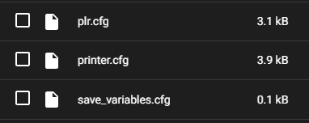
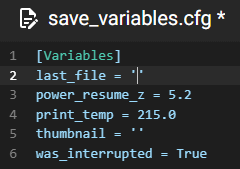

# Klipper-Power-Loss-Recovery

Βασισμένο στο [https://github.com/Travis90x/plr-klipper](https://github.com/Travis90x/plr-klipper)

Based on [https://github.com/Travis90x/plr-klipper](https://github.com/Travis90x/plr-klipper)

Χρήση / Usage:
<https://www.youtube.com/watch?v=XvJMC4jv4xA&ab_channel=Travis90x>

Και τα δυο αρχεία ([plr.cfg](plr.cfg) και [plr.sh](plr.sh)) είναι του Travis90x και έχουν τροποποιηθεί μόνο τα μονοπάτια.

Both files ([plr.cfg](plr.cfg) and [plr.sh](plr.sh)) are from Travis90x and only the paths have been modified.

# 1. Εγκατάσταση / Installation

Απαιτείται να γίνει εγκατάσταση της επέκτασης **gcode_shell_command.py** στον φάκελο *klipper/klippy/extras*. 
(Για ευκολία, μπορεί να χρησιμοποιηθεί το πρόγραμμα WinSCP ή παρόμοιο πρόγραμμα.)
Η επέκταση μπορεί να γίνει λήψη από εδώ: [https://github.com/th33xitus/kiauh/blob/master/resources/gcode_shell_command.py](https://github.com/th33xitus/kiauh/blob/master/resources/gcode_shell_command.py)

The **gcode_shell_command.py** extension is required to be installed in the *klipper/klippy/extras* folder. 
(For convenience, WinSCP or a similar program can be used.)
The extension can be downloaded here: [https://github.com/th33xitus/kiauh/blob/master/resources/gcode_shell_command.py](https://github.com/th33xitus/kiauh/blob/master/resources/gcode_shell_command.py)

# 2. Αλλαγή αδειών στο αρχείο / Change permissions on plr.sh

α. Αντιγραφή του αρχείου plr.sh στον φάκελο */home/pi/printer_data/config/scripts/* ή */home/pi/klipper_config/scripts* (ανάλογα την εγκατάσταση και τον τρόπο εγκατάστασης).
(Για ευκολία, μπορεί να χρησιμοποιηθεί το πρόγραμμα WinSCP ή παρόμοιο πρόγραμμα.)

a. Copy the plr.sh file to the */home/pi/printer_data/config/scripts/* or */home/pi/klipper_config/scripts* folder (depending on the installation and how it was installed).
(For convenience, WinSCP or a similar program can be used.)

β. Με την χρήση του προγράμματος putty (ή κάποιο παρόμοιο πρόγραμμα) γίνεται περιήγη στον φάκελο που περιέχει το αρχείο plr.sh. Κατόπιν χρησιμοποιείται η εντολή `sudo chmod +x plr.sh` σε raspberry pi.
(Αν εκτελεστεί σωστά χρειάζεται επιβεβαίωση του κωδικού πρόσβασης του raspberry pi η άλλης συσκευής που χρησιμοποιείται για το klipper.)

b. Using the putty (or a similar program) browse to the folder containing the plr.sh file. Then `sudo chmod +x plr.sh` command is used on raspberry pi.
(If executed correctly, the raspberry pi password of the other device used for the klipper needs to be confirmed.)

# 3. Προσθήκη στο / Add in printer.cfg

[save_variables]

filename: ~/save_variables.cfg # needed for Power Loss Recovery plr.cfg

# 4. plr.cfg / save_variables.cfg

# 5. CURA Slicer

### Ενδίκνυεται χρήση μόνο του CURA slicer για λόγους συμβατότητας.
1. Προσθήκη στην τελευταία γραμμή του start gcode: *save_last_file*
2. Προσθήκη στην πρώτη γραμμή του end gcode: *clear_last_file*
3. Σε κάθε αλλαγή επιπέδου: *LOG_Z*

**Ο παραγομενος κώδικας .gcode πρέπει να εχει όσο το δυνατόν λιτότερα Post Processing Scripts.**

### It is recommended to use only the CURA slicer for compatibility reasons.
1. Add to last line of start gcode: *save_last_file*
2. Add to first line of end gcode: *clear_last_file*
3. On every level change: *LOG_Z*

**Generated .gcode should have as few Post Processing Scripts as possible.**

